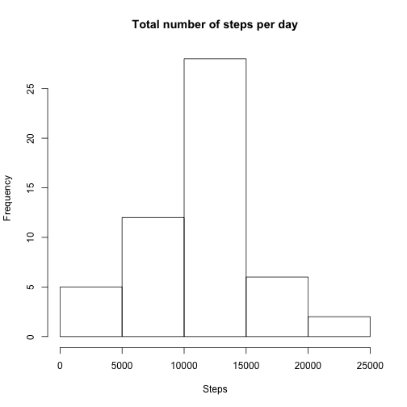
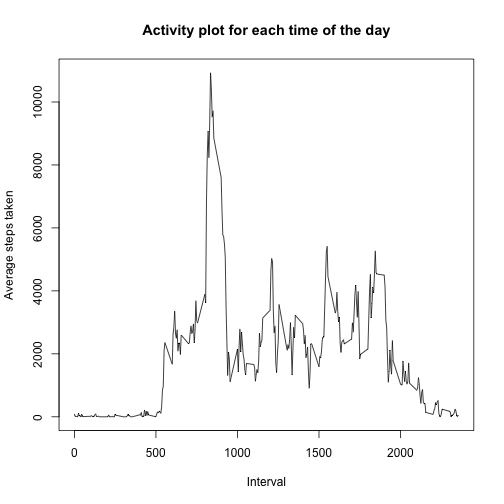
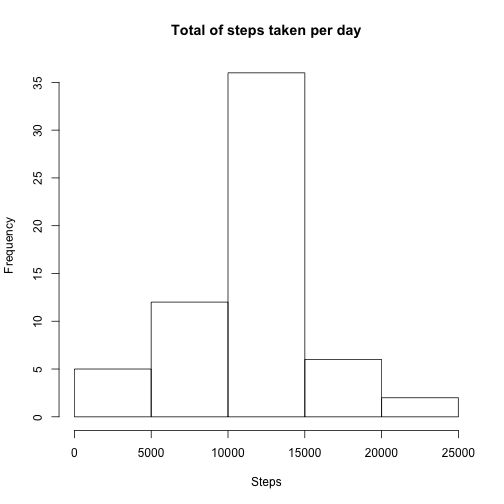
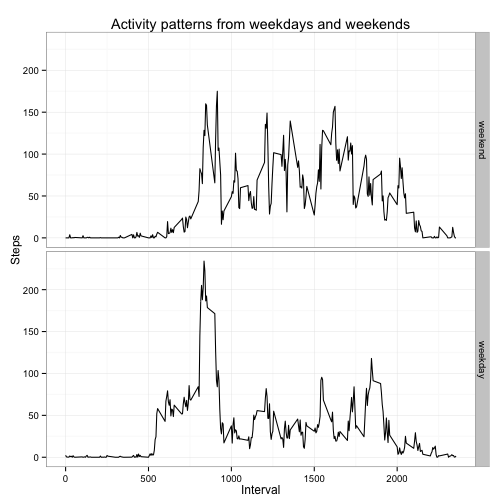

## Loading and preprocessing the data


```r
temp = tempfile()
download.file("https://d396qusza40orc.cloudfront.net/repdata%2Fdata%2Factivity.zip", temp, method="curl")
data=read.csv(unzip(temp))
unlink(temp)
# Setting the variable date in the dataset to be of class POSIXct (date)
data = transform(data, date = as.POSIXct(date))
```

## What is the mean total number of steps taken per day?


```r
library(plyr)
#Summarize the data so it takes the sum for every day
totalSteps = ddply(data, .(date), summarize, totalSteps=sum(steps))
# Histogram of the summarized data
hist(totalSteps$totalSteps, xlab="Steps", main="Total number of steps per day")
```

 

```r
# Mean
mean(totalSteps$totalSteps,na.rm=T)
```

```
## [1] 10766.19
```

```r
# Median
median(totalSteps$totalSteps,na.rm=T)
```

```
## [1] 10765
```

## What is the average daily activity pattern?


```r
library(plyr)
stepsByInterval = ddply(data, .(interval), summarize, meanSteps = sum(steps, na.rm=T))
with(stepsByInterval, plot(interval, meanSteps, type="l", xlab="Interval", ylab="Average steps taken", main="Activity plot for each time of the day"))
```

 

```r
# Max value 
stepsByInterval$meanSteps[which.max(stepsByInterval$meanSteps)]
```

```
## [1] 10927
```

## Imputing missing values


```r
# Number of NAs in the steps vector
sum(is.na(data))
```

```
## [1] 2304
```

```r
# Function to impute NA values and setting the value as the mean of the interval that is the same
NAimpute = function(x) {
     x[is.na(x)] = mean(x, na.rm=T)
     x
}

# Use the NAimpute function to impute the NAs and reorder it by creating a new variable, date
histData = ddply(data, .(interval), summarize, steps=NAimpute(steps))

dateVect = unique(data$date)
histData$date = rep(dateVect, length(unique(histData$interval)))

histData = histData[order(histData$date),]

# Summarize the data so it returns the total number of steps taken each day
histData = ddply(histData, .(date), summarize, totalSteps=sum(steps))

# Create a histogram of the data
hist(histData$totalSteps, xlab = "Steps", main="Total of steps taken per day")
```

 

```r
# Mean
mean(histData$totalSteps)
```

```
## [1] 10766.19
```

```r
# Median
median(histData$totalSteps)
```

```
## [1] 10766.19
```

The mean and median almost don't change, but the plot output is a bit different because the NA imputation changes the NAs so the sum for each day is bigger.

## Are there differences in activity patterns between weekdays and weekends?


```r
# Add a new variable to the dataset, weekday. To find which dates are weekdays and which weekends I call the function isWeekend and create a factor variable based on the logical vector outcome of the function
library(timeDate)
library(ggplot2)

weekData=data
weekData$weekday = factor(isWeekday(weekData$date), labels=c("weekend", "weekday"))

weekdayData = ddply(weekData, .(weekday, interval), summarize, steps=mean(steps, na.rm=T))

# Use ggplot to plot the data
qplot(interval, steps, data=weekdayData, geom="line", facets=weekday~., xlab="Interval", ylab="Steps", main = "Activity patterns from weekdays and weekends") + theme_bw()
```

 
